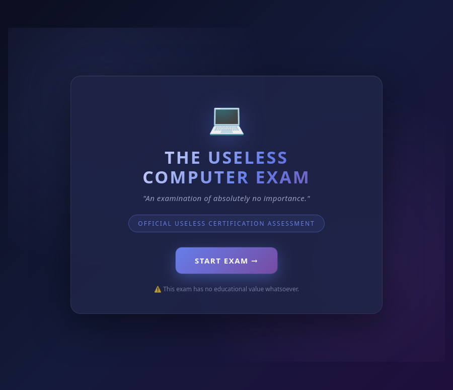
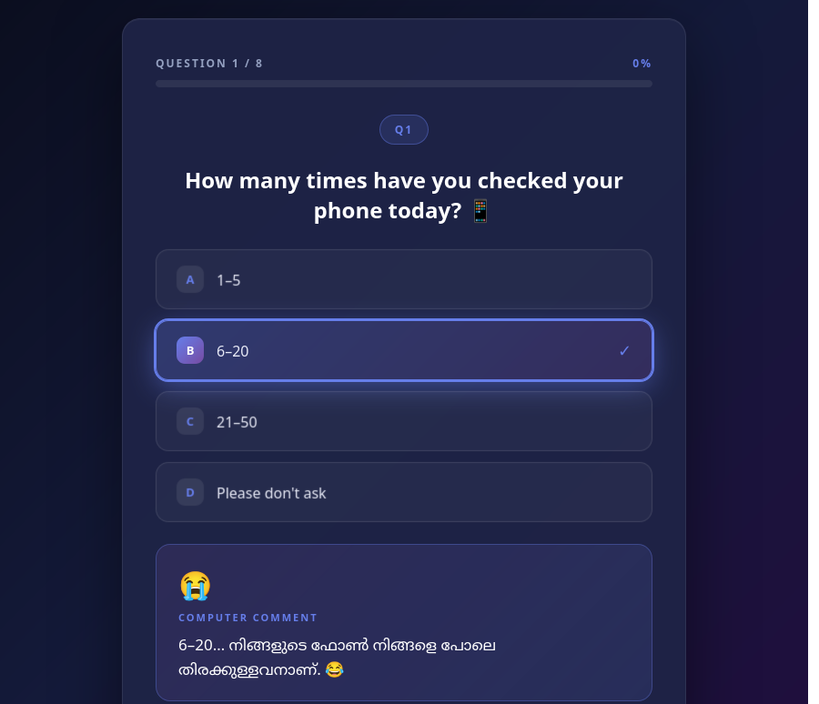
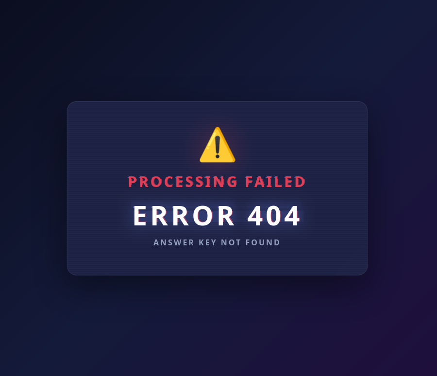
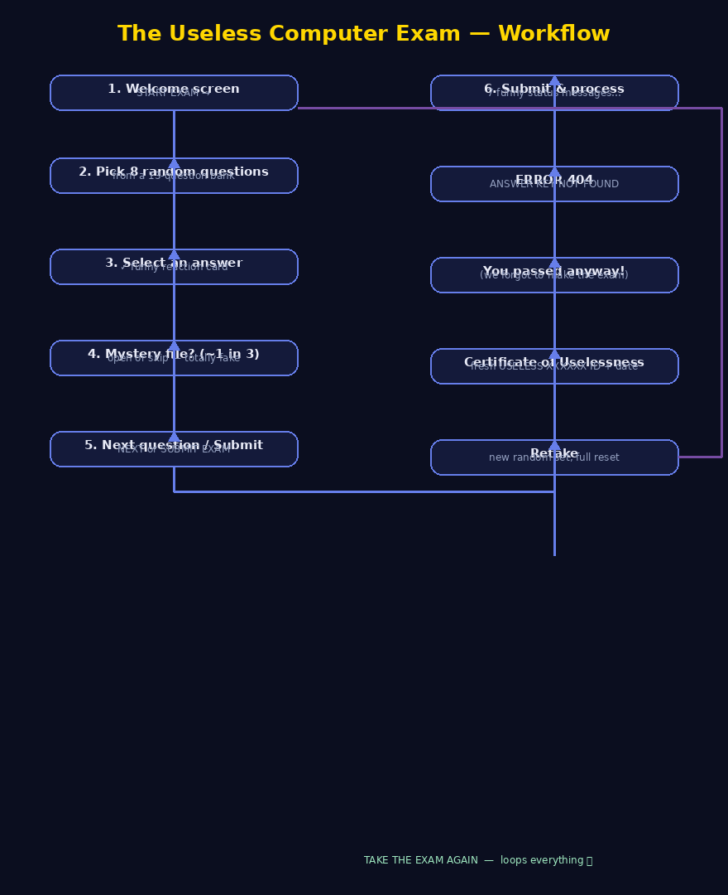

# The Useless Computer Exam 🎯

## Basic Details

### Team Members
- Team Lead: Divyadas.k - ASET
- Member 2: Daya.s- ASET
- Member 3: [Name] - [College]

### Project Description
Useless computer exam-A fun and completely useless computer based exam filled with weired question and unexpected intractions.

### The Problem (that doesn't exist)
This project solves the imaginary problem of making computer exams unnecessarily confusing,funny and entertaining.

### The Solution (that nobody asked for)
We solved the imaginary problem by creating a completely unnecessary computer exam filled with weird questions,random interactions and unexpected surprises.Even useless problems deserve a software solution

## Technical Details

### Technologies/Components Used
For Software:
- Languages used: HTML5, CSS3, vanilla JavaScript, JSON
- Frameworks used: None — 100% vanilla, no frameworks, no libraries, no databases
- Libraries used: None (zero dependency footprint)
- Tools used: Python 3 (built-in local server), any browser, a text editor. Geckodriver + headless Firefox (optional, for automated testing)

For Hardware:
- Main components: a single desktop/laptop computer (the exam only lives in the browser)
- Specifications: any PC that can run a modern browser; a typical college lab machine is more than enough
- Tools required: keyboard + mouse (and one finger for the Enter key)

### Implementation
For Software:

# Installation
No installation required — keep the project folder together and make sure Python 3 is present.
```
sudo apt install python3      # only if Python 3 is not already installed
```

# Run
```
cd The-Useless-Computer-Exam
python3 -m http.server 8000
```
Then open http://localhost:8000 in your browser and click START EXAM.
(Note: the question bank is loaded via fetch(), so the app is served through a local server. Opening index.html directly shows a friendly "QUESTION BANK COULD NOT LOAD — use a local server" notice. This is intended behaviour.)

### Project Documentation

For Software:

# Screenshots (Add at least 3)

*The official-looking welcome screen — "An examination of absolutely no importance."*


*Answering one of the weird questions highlights your option and triggers a funny reaction card.*


*After "passing", the Certificate of Uselessness appears with a fresh USELESS-XXXXXX exam ID and the date.*


*Every attempt picks a new random set of questions, with the full exam UI (badge, options, progress bar).*

# Diagrams

*Workflow: Welcome → START → 8 random questions (answer → reaction + optional mystery file ≈1 in 3) → submit → dramatic processing → ERROR 404 – Answer Key Not Found → you passed anyway → Certificate → Retake.*

For Hardware:

# Schematic & Circuit
Not applicable — this is a purely software project; there is no hardware or circuit.

# Build Photos
Not applicable — there is no physical build. The "product" is the web app shown in the screenshots above.

### Project Demo
# Video
<video controls width="640">
  <source src="demo-video.mp4" type="video/mp4">
  Your browser does not support HTML5 video.
</video>
*Screencast of the exam being taken live (recorded with GNOME Screen Recorder).*

# Additional Demos
- Live preview: run `python3 -m http.server 8000` and open http://localhost:8000
- Automated browser test results are documented in QA-AUDIT.md (15/15 checks passed)

## Team Contributions
- Divyadas.k: Project concept, exam branding & welcome screen, overall exam flow (team lead)
- Daya.s: Question bank content ("THE USELESS QUESTIONS"), Malayalam reactions, and the certificate / result screens
- [Name]: Final testing & polish, screenshots, and documentation

---
Made with ❤️ at TinkerHub Useless Projects 


